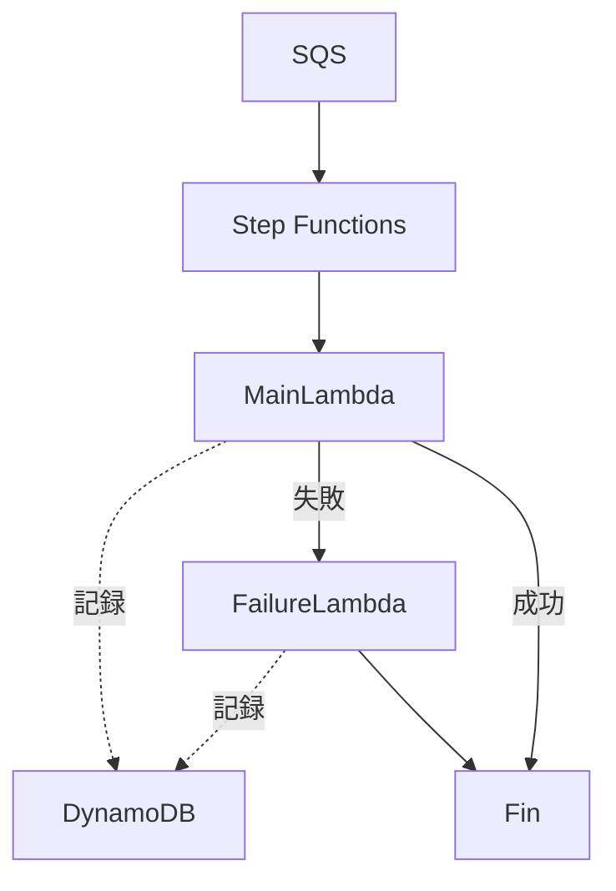

# Step Functions Lambda Recover Example

## 概要

SQS からのリクエストをトリガーに Step Functions を実行し、
main_handler Lambda で 5 割の確率で DynamoDB に成功を記録、失敗時は別の failure_handler Lambda で DynamoDB に失敗を記録する構成例です。

## 構成図



## デプロイ・動作手順

make ファイルで管理しています。
内部の詳細な処理は makefile 参照

```sh
make build
make deploy
```

### 動作確認 - SQSにテストメッセージ投入

AWS CLI例：

```sh
aws sqs send-message \
    --queue-url "https://sqs.ap-northeast-1.amazonaws.com/$AWS_ACCOUNT/stepfunc-sample-queue" \
    --message-body '{"id": "test-001"}'
```

いくつかかメッセージを入れるワンライナー

```sh
for i in {1..5}; do aws sqs send-message --queue-url "https://sqs.ap-northeast-1.amazonaws.com/$AWS_ACCOUNT/stepfunc-sample-queue" --message-body "{\"id\": \"test-00$i\"}" --region ap-northeast-1; done
```

### クリーンアップ

```sh
cd terraform
terraform destroy
```

## Tips

### StepFunctions の失敗時、入力を引き継ぐ書き方

Step Functions で ResultPath を使用して状態出力を指定する。
結果を破棄し、元の入力を保持する。

> ResultPath を に設定するとnull、状態は元の入力を出力に渡します。状態の入力ペイロードは、タスク結果に関係なく、出力に直接コピーされます。

https://docs.aws.amazon.com/ja_jp/step-functions/latest/dg/input-output-resultpath.html#input-output-resultpath-catch
